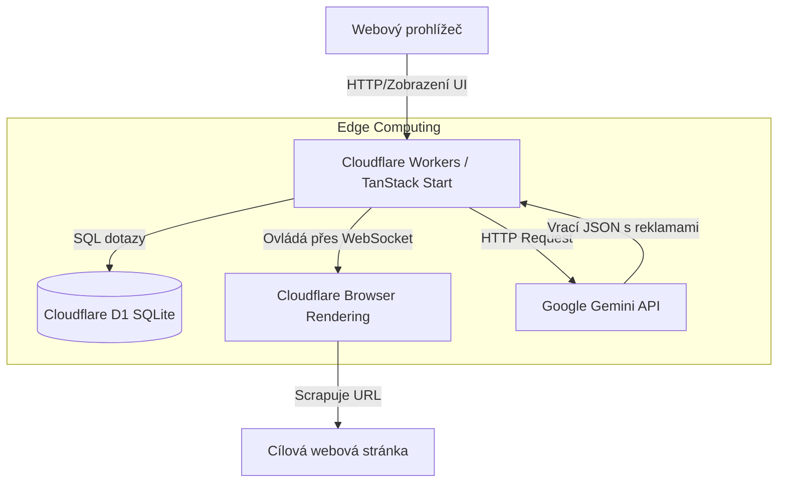

# 🌊 LagoonEdge: AI Ad Generator & Cloudflare Boilerplate


> [!NOTE]
> *Vytvořeno pomocí nástroje **Antigravity CLI** a s využitím **Google AI Studio API Key**.*

Moderní full-stack projekt postavený na technologii **TanStack Start** (React), optimalizovaný pro běh v ultra-rychlém a škálovatelném edge prostředí **Cloudflare Workers / Pages**. Projekt demonstruje stavbu komplexní AI aplikace – od scrapování cizích webů přes headless prohlížeč až po generování strukturovaného reklamního obsahu pomocí velkých jazykových modelů (LLM).

Vzhled a stylování zajišťuje **Tailwind CSS v4.0** s moderním designem, efekty skleněného povrchu (glassmorphism) a plynulými mikro-animacemi.

---

## ✨ Hlavní aplikace: LagoonEdge AI Generátor (`/lagoonedge`)

Jádrem projektu je komplexní nástroj na tvorbu reklamních kampaní na pár kliknutí.

1. **Skenování webu (Puppeteer & Cheerio):** Zadáte URL adresu libovolné firmy. Aplikace na Cloudflaru spustí neviditelný Chrome prohlížeč, projde web, počká na načtení dynamického obsahu a vyextrahuje čistý text. Pro parsování dat a obrázků využívá robustní DOM parser `cheerio`.
2. **Extrakce profilu značky (Google Gemini & Zod):** Ze získaného textu model *Gemini 2.5 Flash* sestaví "Brand Profile" (název, cílovka, tón komunikace, paleta barev). Výstup z AI je před zapsáním do databáze striktně kontrolován a validován pomocí knihovny `zod`.
3. **Generování reklam (Google Gemini):** Na základě profilu značky AI vygeneruje 3 unikátní a chytlavé reklamní kreativy včetně nadpisů a výzev k akci (CTA). Každou kreativu si navíc v UI můžete libovolně upravit nebo nechat znovu přegenerovat.

## 🚀 Technologický Stack & Architektura

* **Frontend:** TanStack Start, React 19, Tailwind CSS v4, Lucide Icons
* **Backend:** Cloudflare Workers (Edge Computing)
* **Databáze:** Cloudflare D1 (Serverless SQLite) + Drizzle ORM
  * *Optimalizace:* Plné využití nativních JSON polí u SQLite, nastaveno kaskádové mazání záznamů (`ON DELETE CASCADE`) napříč databázovým schématem.
* **AI & Zpracování dat:**
  * Google Gemini API (model `gemini-2.5-flash`)
  * Cloudflare Browser Rendering (`@cloudflare/puppeteer`)
  * `zod` pro validaci a vynucení JSON schémat z výstupů umělé inteligence
  * `cheerio` pro spolehlivé parsování HTML fallback struktury

### 🏗️ Architektura aplikace



---

## 📂 Adresářová struktura

```text
tanstack/
├── drizzle/                # SQL migrační soubory vygenerované Drizzle Kit
├── src/                    # Zdrojový kód aplikace
│   ├── db/                 # Databázová konfigurace
│   │   ├── index.ts        # Inicializace Drizzle ORM (připojení na D1)
│   │   └── schema.ts       # Databázové schéma (JSON pole a kaskádové vztahy)
│   ├── lib/services/       # Obchodní logika a backendové služby
│   │   ├── ai.ts           # Integrace Gemini a striktní validace pomocí Zod
│   │   ├── scraper.ts      # Cloudflare Puppeteer scraper s Cheerio fallbackem
│   │   └── pipeline.ts     # Orchestrátor celého procesu generování
│   ├── routes/             # Souborově orientované směrování (file-based routing)
│   │   ├── __root.tsx      # Globální layout, HTML kostra
│   │   ├── index.tsx       # Hlavní domovská stránka (/)
│   │   └── lagoonedge.tsx  # Hlavní aplikace pro generování reklam
│   └── styles.css          # Globální CSS a CSS Proměnné (LagoonEdge Design System)
├── gemini-config.json      # Centralizovaná konfigurace pro Google Gemini LLM
├── package.json            # NPM závislosti, metadata a skripty
├── vite.config.ts          # Vite sestavení (pluginy React, Tailwind, Cloudflare)
└── wrangler.jsonc          # Produkční konfigurace Cloudflare
```

---

## 💻 Lokální vývoj (Spuštění projektu)

Pro lokální běh projektu na vašem počítači postupujte podle následujících kroků:

> [!WARNING]  
> Ujistěte se, že máte nainstalovaný **Node.js (v22+)** a jste v adresáři `/tanstack`.

### 1. Přihlášení do Cloudflare a instalace

Nejprve se přihlaste ke svému Cloudflare účtu (Miniflare potřebuje komunikovat s prostředky pro Browser Rendering a D1) a nainstalujte závislosti:

```bash
cd tanstack
npx wrangler login
npm install
```

### 2. Vytvoření lokálního souboru s tajnými klíči (`.dev.vars`)

Vytvořte soubor `.dev.vars` v adresáři `tanstack/` a přidejte do něj svůj Google Gemini API klíč:

```env
GEMINI_API_KEY="vas-google-gemini-api-klic"
```

### 3. Příprava lokální databáze (Migrace)

Převeďte definované schéma z kódu do SQL migrací a aplikujte je na lokální SQLite databázi:

```bash
npm run db:generate
npm run db:migrate:local
```

### 4. Spuštění serveru

```bash
npm run dev
```

Aplikace poběží na adrese [http://localhost:3000](http://localhost:3000).

---

## 🌐 Nasazení na Cloudflare (Produkce)

### 1. Vytvoření ostré D1 databáze

Vytvořte novou databázi přes Wrangler CLI:

```bash
npx wrangler d1 create my-binding-database
```

Příkaz vám vygeneruje unikátní `database_id` (UUID). Otevřete `wrangler.jsonc` a nahraďte hodnotu `database_id` vaším novým klíčem.

### 2. Nahrání API klíče na Cloudflare

Aby vaše aplikace mohla komunikovat s AI v produkci, nahrajte Gemini klíč na Cloudflare servery bezpečně přes secret:

```bash
npx wrangler secret put GEMINI_API_KEY
```

### 3. Aplikace migrací v produkci

Nahrajte schéma tabulek do ostré databáze:

```bash
npm run db:migrate:prod
```

### 4. Nahrání aplikace (Deployment)

Sestavte projekt a nahrajte jej na servery Cloudflaru:

```bash
npm run deploy
```

---

## 🛠️ Přehled NPM příkazů

| Skript | Příkaz | Popis |
| :--- | :--- | :--- |
| `npm run dev` | `vite dev --port 3000` | Spustí lokální vývojový server |
| `npm run build` | `vite build` | Sestaví produkční balíček (klient + server) |
| `npm run preview` | `vite preview` | Náhled sestaveného produkčního balíčku lokálně |
| `npm run deploy` | `npm run build && wrangler deploy` | Sestaví projekt a nahraje jej na Cloudflare |
| `npm run db:generate` | `drizzle-kit generate` | Vytvoří SQL migrační soubory z kódu ve `schema.ts` |
| `npm run db:migrate:local` | `wrangler d1 migrations apply ... --local` | Aplikuje SQL změny na lokální SQLite |
| `npm run db:migrate:prod` | `wrangler d1 migrations apply ... --remote` | Aplikuje SQL změny na Cloudflare D1 |
| `npm run lint` | `eslint` | Provede analýzu kódu a vyhledá chyby |

---

## 📝 Poznámky k zadání (Snaprime Hiring Assignment)

> [!IMPORTANT]
> **Přístup a Architektura:**
> Tento úkol (vertical slice) byl postaven na **TanStack Start** pro full-stack routing a React vrstvu v kombinaci s **Cloudflare Workers, Pages a D1**. Toto nastavení zajišťuje, že aplikace i databáze běží nativně na edge infrastruktuře, což splňuje požadavky na perzistenci, rychlost a reálnou nasaditelnost.

### Implementační detaily k hlavnímu úkolu (Extrakce & Generování)

1. **Extrakce:** Zaintegrován **Cloudflare Browser Rendering** (`@cloudflare/puppeteer`) pro zpracování stránek vykreslovaných JavaScriptem. Kvůli možným timeoutům v edge workerech byl vytvořen i **graceful fallback** využívající standardní `fetch` + `cheerio`. Pokud headless prohlížeč selže, pipeline nespadne a spolehlivě naparsuje základní HTML metadata.
2. **AI vrstva:** Použito **Google Gemini API** (`gemini-2.5-flash`), které vyniká nativní podporou "Structured Outputs" (generování JSON schémat přes HTTP) bez externích závislostí. Pomocí `zod` je garantována validace. Je nastavena bezpečnostní pojistka: pokud LLM obsah nenajde, vrátí `not found` a generování se bezpečně přeruší (zamezení halucinacím).
3. **Perzistence a Náhledy:** Reklamy a profily jsou ukládány do **Cloudflare D1** přes **Drizzle ORM**. Editace a znovugenerování reklam jsou řešeny jako *Row updates* v SQLite, což předchází konfliktům a přepisům.

### ⚖️ Co bylo záměrně odloženo a zjednodušeno

Vzhledem k rozpočtu zhruba 5-6 hodin jsem upřednostnil vytvoření kompletní, plně funkční pipeline *(Scrape -> Extract -> DB -> UI -> Edit/Regenerate)*. Z toho důvodu:
* **Deduplikace obrázků:** Obrázky se filtrují heuristicky podle minimální velikosti (vynechání ikon), bez využití vektorové podobnosti.
* **Přesná extrakce barev:** Barvy jsou tahány přes RegEx z HTML namísto složitého dotazování computed CSS přes Puppeteer (vyžaduje zbytečně hodně prostředků a AI barvy trefuje velmi dobře i tak).
* **Uživatelské účty:** Identifikace relací probíhá automaticky skrz unikátní `siteId` v URL parametrech (žádný login).
* **LLM Caching:** Databáze sice cachuje vygenerované výsledky, ale mezikroky samotné LLM extrakce (při opakovaném testu stejné URL) zjednodušeně necachujeme z důvodu omezeného času.

### 🤖 Využití AI Agenta
* **Agent:** Použit autonomní programovací asistent **Antigravity**.
* **Přínos:** Zásadní pomoc při konfiguraci Drizzle na Cloudflare D1 v TanStack Start prostředí. Efektivní generování boilerplate kódu pro Puppeteer v edge workeru.
* **Výzvy (a řešení):**
  1. *Rozdíl `process.env` vs Cloudflare `env`:* Agent zpočátku padal do pasti Node.js env proměnných. Musel se nasměrovat na bindování `env` z TanStack kontextu.
  2. *Halucinace AI:* Model se pokoušel vymýšlet data při nedostatku obsahu na URL. Zavedli jsme přísné Zod validace a `not found` pojistku v system promptu.
  3. *Verzování Modelu:* Snaha "přepsat vše na 3.5" narazila na limity API, agent vrátil stabilní `gemini-2.5-flash` a zachoval štítky 3.5 čistě v rámci UI.
